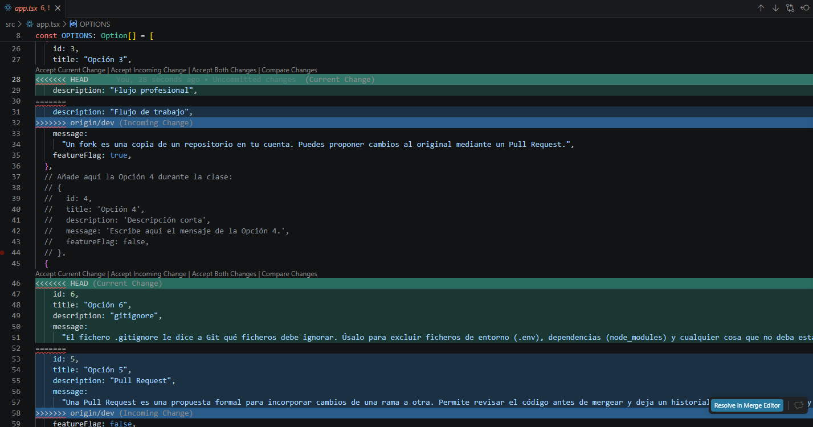
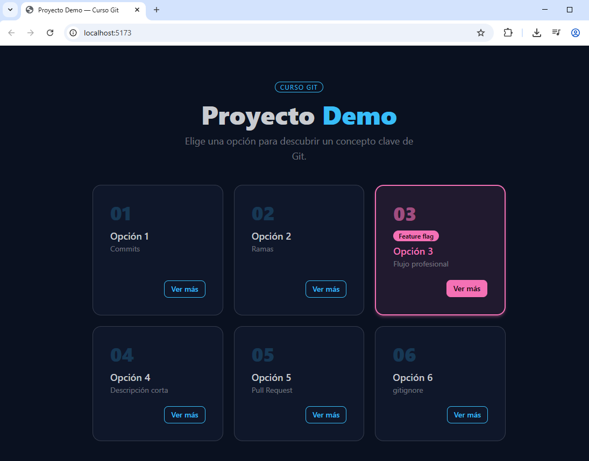
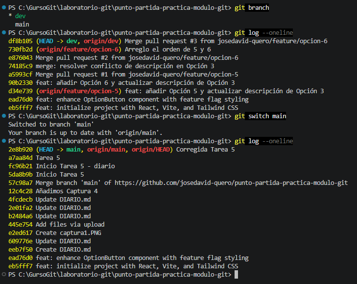

# Laboratorio - Flujo Git colaborativo: José David Quero Sánchez

# Tarea 1 — Fork y configuración inicial
**fork**: Es una copia de un repositorio que hago en mi cuenta de GitHub. Es la forma de colaborar en proyectos OpenSource.

**upstream**: Es un remoto que, por convención, se llama upstream y que es un remote que apunta al repositorio raíz del que hemos hecho fork.

# Tarea 2 — Feature branch A: añadir la Opción 5
Se parte de **dev** porque es la rama para desarrollo e integración, mientras que **main** es la rama de producción.

# Tarea 3 — Feature branch B: añadir la Opción 6 (aquí está el conflicto)
Un conflicto se produce cuando dos personas modifican el mismo fichero a la vez e intentan fusionarlo, de forma que Git se encuentra con dos versiones diferentes de la misma línea y no sabe cuál es la correcta.

En nuestro caso, tanto la rama **feature/opcion-5** como la rama **feature/opcion-6** parten de la rama **dev** y modifican el campo **description** de la **Opción 3** del fichero **app.tsx**. Cuando se intenten fusionar ambas ramas a **dev** se producirá el conflicto y deberemos decidir cuál de los dos cambios es el correcto.

# Tarea 4 — Pull Request 1: Feature A a dev
En la pestaña **Files Changed** revisé los cambios producidos en el fichero **app.txs** en la rama **feature/opcion-5** respecto del mismo fichero en la rama **dev** desde donde se creó dicha rama. Esto es útil para saber si se trata de cambios conflictivos para poder tomar la decisión sobre incorporarlos o no a la rama **dev**. En nuestro caso vemos cómo se ha modificado la descripción de la **Opción 3** y se ha añadido la **Opción 5** y, como nos parece correcto, hacemos **Merge** para incorporarlos.

# Tarea 5 — Pull Request 2: Feature B a dev, conflicto
El código que aparece entre **<<<<<<< HEAD** y **=======** son nuestros cambios actuales en la rama **feature/opcion-6**.

El código que aparece entre **=======** y **>>>>>>> origin/dev** son los cambios del fichero en la rama **dev**, que incluyen los cambios de **feature/opcion-5**.

Como se nos indica que nos quedemos la descripción de la Opción 3 **"Flujo profesional"** que es la de nuestra rama acutal, hay que pulsar **Accept Current Change**.

También se nos indica que la app en el navegador debe mostrar todas las opciones visibles, por lo que hay que pulsar **Accept Both Changes**. Eso no es todo, además:
- Hay que poner las opciones 5 y 6 en su orden correcto.
- Tenemos que cerrar y abrir las llaves entre opciones correctamente.
- Falta añadir la línea **feature=false** en la Opción 6.
- Hay que añadir el fichero **.env** con el contenido **VITE_FEATURE_OPCION_3=true** para que se vea la Opción 3.
- Hay que descomentar la Opción 4 para que también se vea.

# Tarea 6 — Limpieza y cierre del diario

Con lo que me he tenido que "pelear" más es con las Pull Request, ya que yo estaba acostumbrado a hacerlo todo desde el interfaz gráfico de Visual Studio. Relacionado con esto, he aprendido a utilizar Git con comandos.

